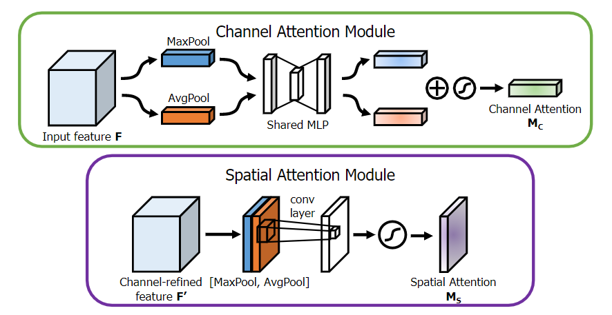
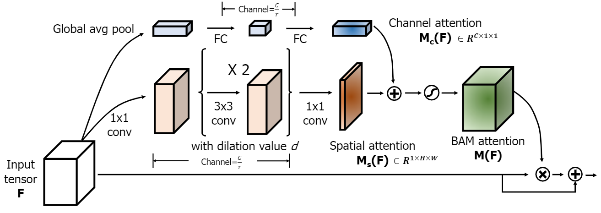

## SEnet:通道注意力


SE : squeeze and excitation 

代码[hujie-frank/SENet: Squeeze-and-Excitation Networks ](https://github.com/hujie-frank/SENet)

输入信息为w * h * c 。

#### squeeze压缩

先通过全局平均池化(GAP)，压缩为1 * 1 * c，即每个通道的信息都被压缩为一个数。

#### excitation激活

1 * 1 * c的信息再经过一个bottleneck结构，

即两个全连接层先降维到 1 * 1 * c/r (r为缩减的倍数)，再升维到1 * 1 * c ，最后再sigmoid一下。

最后这个 1 * 1 * c  对应每个channel的权重。通过乘法，逐通道加权到先前的每个通道特征上 。

#### pytorch代码

```python
class SELayer(nn.Module):
    def __init__(self, channel, reduction=16):
        super(SELayer, self).__init__()
        self.avg_pool = nn.AdaptiveAvgPool2d(1)
        self.fc = nn.Sequential(
            nn.Linear(channel, channel // reduction, bias=False),
            nn.ReLU(inplace=True),#
            nn.Linear(channel // reduction, channel, bias=False),
            nn.Sigmoid()
        )

    def forward(self, x):
        b, c, _, _ = x.size()
        y = self.avg_pool(x).view(b, c)
        y = self.fc(y).view(b, c, 1, 1)
        return x * y.expand_as(x)

```


## CBAM:先通道注意力再空间注意力

论文[CBAM: Convolutional Block Attention Module](http://openaccess.thecvf.com/content_ECCV_2018/papers/Sanghyun_Woo_Convolutional_Block_Attention_ECCV_2018_paper.pdf)

代码[luuuyi/CBAM.PyTorch](https://github.com/luuuyi/CBAM.PyTorch)



在SEnet基础上做了以下两点优化

#### 全局最大池化

同时进行了全局平均池化和全局最大池化，并将最后结果相加，获取到1 * 1 * c矩阵。

再通过乘法，逐通道加权到先前的每个通道特征上 。

#### 空间注意力

使用了通道注意力加权后的后的特征。

同样分别进行全局平均和最大池化，并且把池化结果做concat操作。

然后经过卷积操作，降维为1个channel。

再经过sigmoid生成空间特征权重，对应原图中每个像素点的权重。

通过乘法，逐像素加权到先前的每个像素特征上 。

#### 代码

```python
class ChannelAttention(nn.Module):
    def __init__(self, in_planes, ratio=16):
        super(ChannelAttention, self).__init__()
        self.avg_pool = nn.AdaptiveAvgPool2d(1)
        self.max_pool = nn.AdaptiveMaxPool2d(1)
           
        self.fc = nn.Sequential(nn.Conv2d(in_planes, in_planes // 16, 1, bias=False),
                               nn.ReLU(),
                               nn.Conv2d(in_planes // 16, in_planes, 1, bias=False))
        self.sigmoid = nn.Sigmoid()

    def forward(self, x):
        avg_out = self.fc(self.avg_pool(x))
        max_out = self.fc(self.max_pool(x))
        out = avg_out + max_out
        return self.sigmoid(out)

class SpatialAttention(nn.Module):
    def __init__(self, kernel_size=7):
        super(SpatialAttention, self).__init__()

        self.conv1 = nn.Conv2d(2, 1, kernel_size, padding=kernel_size//2, bias=False)
        self.sigmoid = nn.Sigmoid()

    def forward(self, x):
        avg_out = torch.mean(x, dim=1, keepdim=True)
        max_out, _ = torch.max(x, dim=1, keepdim=True)
        x = torch.cat([avg_out, max_out], dim=1)
        x = self.conv1(x)
        return self.sigmoid(x)
```


## BAM：通道注意力和空间注意力并行，最后相加

论文[BAM: Bottleneck Attention Module](https://arxiv.org/pdf/1807.06514.pdf)

没啥好说的，只是从原本的串行，改为并行最后相加，和CBAM同作者。


